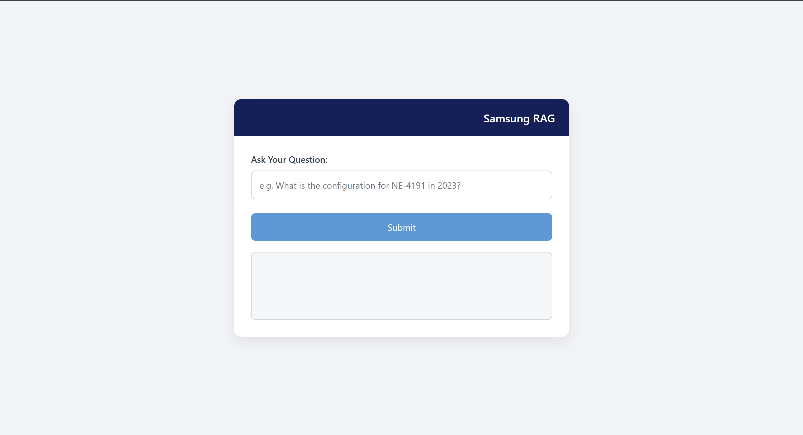

# 🔍 Retrieval-Augmented Generation (RAG) for Network Element Data Querying

This project implements a **Retrieval-Augmented Generation (RAG)** pipeline that enables users to query **network element data** using natural language via a user-friendly **HTML frontend interface**. It combines traditional information retrieval with generative AI to deliver accurate, context-aware responses grounded in your data.

---

---

##  Features

- ✅ Upload and index structured network element data (CSV)
- ✅ Query in plain English (e.g., "Which element had the highest latency?")
- ✅ Generate responses using LLMs like Gemini
- ✅ Lightweight frontend with live API interaction
- ✅ Modular design for easy extension

---

##  Frontend

The frontend is a simple HTML page where users can:

- Enter a natural language query
- View the LLM-generated response
- Interact with the backend via JavaScript `fetch` API
- Gives you the option to download the results in csv

##  Backend Logic

1. **Preprocessing**: CSV data (e.g., network_elements.csv) is cleaned and split into smaller chunks for better embedding.
2. **Embedding**: Each chunk is converted into a vector using a pre-trained embedding model like OpenAI or HuggingFace.
3. **Vector Storage with ChromaDB**:
   - Vectors are stored and indexed using **ChromaDB**, a scalable local vector database.
   - ChromaDB handles persistence and similarity search.
4. **Retrieval**: When a query is received, its embedding is computed and ChromaDB retrieves the most similar chunks.
5. **Generation**: The top-k chunks and user query are passed to a language model (like GPT) to generate a context-aware, grounded response.

## How to run ?
1. **Clone the repo**: [Repo](https://github.com/Akshatkhurana/RAG-Pipeline?tab=readme-ov-file#backend-logic)
2. cd RAG-pipeline
3. Install Dependencies pip install -r requirements.txt
4. Run the backend cd backend 
- cd backend
- python app.py
5. Open frontend with Live server

